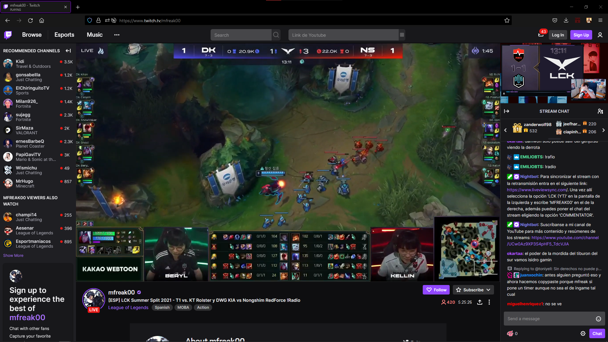

# RadioCast Extension

RadioCast Extension es una extensión para los radio casts (wow!).

Permite insertar vídeos de Youtube dentro de Twitch. Así, podrás ver cualquier radiocast sin tener que recurrir a webs de terceros y sin miedo a ninguna "Purple Screen of Death" por parte de Twitch.

| Lo bueno | Lo malo |
|---|---|
| ✅ Puedes insertar cualquier video de Youtube | ❌ Todavia esta en beta |
| ✅ Soporte para modo Teatro y pantalla completa | ❌ Algunas cosas se pueden romper 😬|
| ✅ Cuando algún anuncio se redimensiona solo |
| ✅ Puedes activar/desactivar la extension desde el menu con un click |

# Roadmap

✅ ~~Que funcione~~

✅ ~~Activar/Desactivar desde el menú~~

✅ ~~Modo teatro~~

🕜 Menú desplegable para seleccionar la competición

🕗 Soporte para videos de otras webs ❓

🕓 Soporte para otros idiomas

🕜 Modo pantalla completa

🕟 Más cosas...
